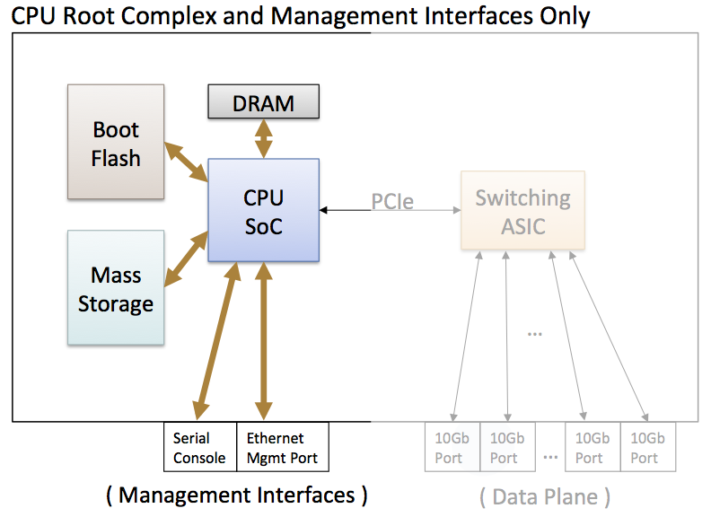
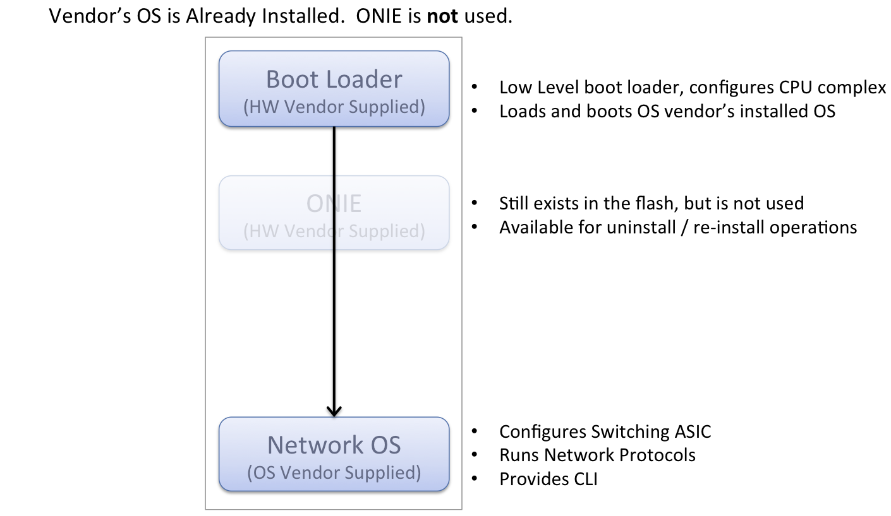
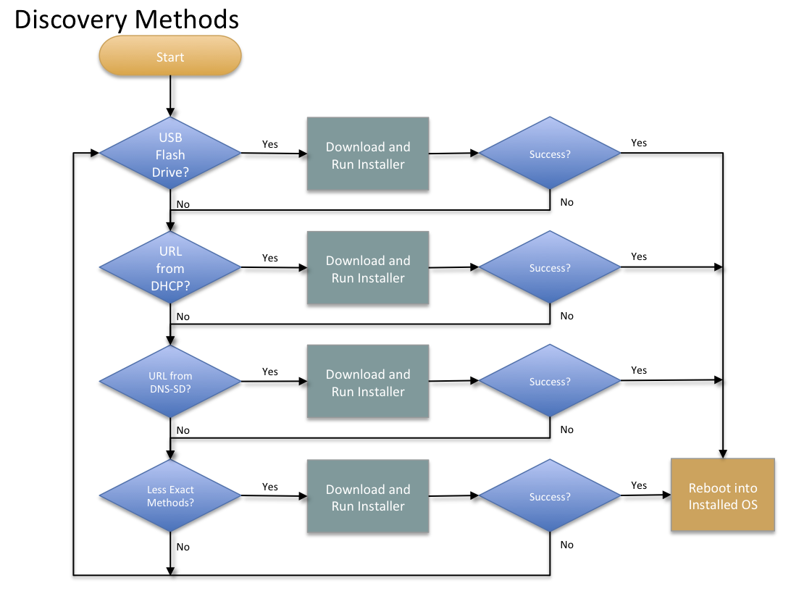

.. _onie_overview:

********
Overview
********

Project Overview
================

The Open Network Install Environment (ONIE) is an open source
initiative that defines an open "install environment" for bare metal
network switches.  ONIE enables a bare metal network switch ecosystem
where end users have a choice among different network operating
systems.

Traditionally Ethernet switches are procured with pre-installed,
captive operating systems, effectively creating networking appliances
that lock end-users into a vertical supply chain.  While there is
industry wide discussion of a mythical "white-box" network switch,
this ecosystem does not exist; failing in part due to the fact that
the hardware cannot accept multiple operating systems.

As a matter of form, these switches have a management subsystem, based
on a variety of CPU architectures that typically include serial
console, out-of-band Ethernet, and sometimes even pluggable mass
storage.  This subsystem can function independently from the switching
ASIC(s) associated with the "front-panel" Ethernet interfaces
(i.e. without a full networking OS).

ONIE defines an open source "install environment" that runs on this
management subsystem utilizing facilities in a Linux/BusyBox
environment. This environment allows end-users and channel partners to
install the target network OS as part of data center provisioning, in
the fashion that servers are provisioned.

ONIE enables switch hardware suppliers, distributors and resellers to
manage their operations based on a small number of hardware SKUs.
This in turn creates economies of scale in manufacturing,
distribution, stocking, and RMA enabling a thriving ecosystem of both
network hardware and operating system alternatives.

**Highlights:**

* Combines a boot loader with a modern Linux kernel and BusyBox
* Provides an environment for installing any network OS
* Disruptive, liberating users from a captive, pre-installed network OS
* Helps automate large scale data center switch provisioning
* Manage your switches like you manage your Linux servers

Design Overview
===============

.. note:: For the complete design see the :ref:`full_design_spec`.

ONIE is the combination of a boot loader and a small operating system
for bare metal network switches that provides an environment for
automated provisioning.  ONIE utilizes the CPU complex of the switch,
but not the forwarding data plane as shown in the following figure:

  Typical Network Switch CPU Complex - ONIE uses the elements highlighted on the left

Initial System Boot
-------------------

When a new machine boots for the first time ONIE locates and executes
a network OS vendorÕs installation program, as shown here:

.. figure:: First_Boot.png
  :scale: 50
  :align: center
  :alt: First Time Boot Up

  Execution Flow -- First Time Boot Up

Subsequent System Boots
-----------------------

ONIE is **not** used on every boot of the system.  After the initial
installation subsequent boots go straight into the network OS,
bypassing ONIE.  This is depicted here:

  Subsequent Boots -- After the network OS is installed

Mechanisms exist for a system to re-enter the installation phase.  An
API is defined so that network operating systems can direct the system
to re-enter the installation phase.

Locating an Installer Image
---------------------------

ONIE uses a number of methods to locate a network OS installer,
including, but not limited to:

* Statically configured from the boot loader
* Locally attached storage, for example a USB memory stick
* DHCPv4 / DHCPv6
* IPv4 / IPv6 link local neighbors
* mDNS / DNS-SD
* PXE-like TFTP waterfall

The preferred method for image download is HTTP as it offers robust
performance for large image sizes.  TFTP is also supported, but its
use is discouraged in favor of HTTP.

Once an image is located ONIE proceeds to execute the network OS
installer.

The following diagram illustrates an example of the location and
execution steps:

  Image Discovery Methods

In the previous diagram the "Less Exact Methods" box refers to
mechanisms that use probing techniques to locate an image, such as:

* IPv4 / IPv6 link local neighbors
* PXE-like TFTP waterfall

Installer Execution Environment
-------------------------------

When executing the installer, ONIE exports a number of environment
variables for the installer to use.  These variables include system
identification information as well as information learned during the
image discovery process.

An example of the information exported to the installer includes:

* Installer URL

* HW vendor identifier

* HW platform identifier

* HW serial number

* Ethernet management MAC address

* IP address (from DHCP)

* Hostname (from DHCP)

These variables allow an installer to integrate with other process
automation and orchestration, immediately tying together serial
numbers, MAC addresses and network OS versions.

Installer Overview
------------------

The installer's responsibility is to persistently install the
operating system into the hardware.  In fulfilling that role an ONIE
compliant network OS installer has a lot of flexibility.

Some examples of what an installer could do:

* Fetch additional binaries and configuration files via HTTP

* Chat with inventory control systems via HTTP

* Download a new kernel+initramfs and kexec(8) into it

Network Operating System Interface
----------------------------------

ONIE provides an environment for a network OS to perform system
provisioning and maintenance operations, including:

* Reinstalling a different network OS

* Uninstalling, i.e. wiping the system clean

* Rescue and recovery

* Updating ONIE

This environment forms an interface between ONIE and the network OS.

Updating ONIE
-------------

ONIE provides a mechanism for updating itself.  This mechanism
proceeds much like the network installer discovery and executing
phase, however the image in this case is an ONIE update image.  Once
located, the ONIE update image is downloaded and executed.
